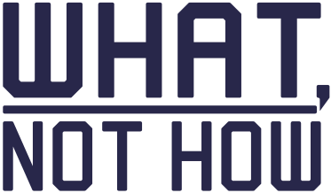

## A DSL for developers defining (software) processes

### Notes on the DSL
- Define the components of the process as they might appear as part of a data-flow diagram
- There are data objects (files / data structures / etc.)
- And there are process steps / subprocesses
- I view this as being a hierarchical data flow diagram where a single process node at one level might require an entire data flow diagram of its own to explain what goes on within that process

## My thoughts behind the title "What, not How."
- TODO: print out or email myself the comments I sent to Graham on requirements gathering
- My thinking on what vs. how.  And "why"
- That the what for one level might be the "how" w.r.t a higher level diagram's process step.
- The primary intent of this DSL and tooling is provide a tool and perhaps some recommended practices to focus on the part that's most important to get right as early as possible -- what the system or process must do, or provide, or produce.  And make it easy and safe to ignore, for now, the implementation details.
- TODO: Continue my thoughts here.
  - Easy for engineers to get drawn into the solving of the problem or coming up with solutions or focusing on the important implementation details.  That's what we're good at, and it's comfortable.  But if we don't get right what we're trying to solve, the solution has much less real value.
  - A great solution to the wrong problem...

## TO-DOs
- See photos of my whiteboard.
- Groups now become a method of specifying the "zoomed-in" version of a process.
- A new keyword for within a group could give a hint as to the process that the group is zoomed-in on
- A new structure for diagram information
  - Provide a means for providing global settings like the tool: mermaid or D2, the orientation (L->R or Top->Bottom)
  - filename base for the diagram code generated
  - image file basename for the SVG images produced
  - a base title for the different diagrams based on what each is zoomed in on 
  - etc.

